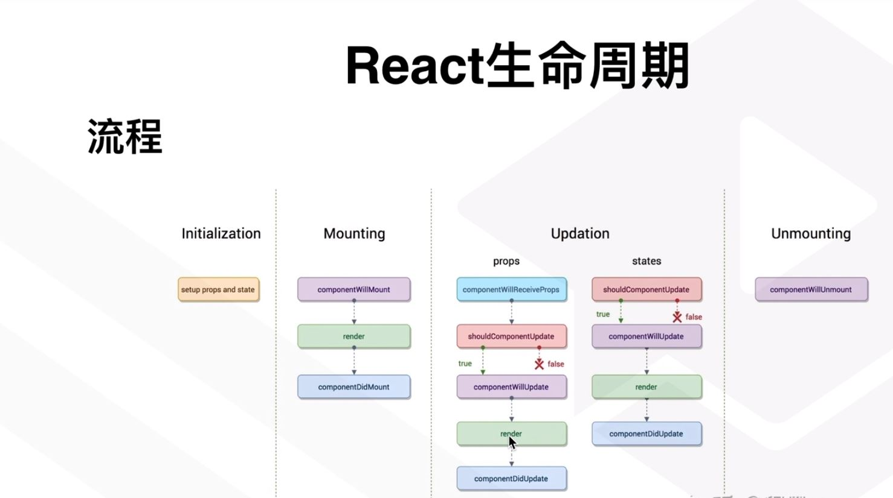

## 特点
1. 声明式设计
2. 高效，采用虚拟dom来实现DOM的渲染，最大限度减少dom的操作。
3. 灵活，跟其他库灵活搭配使用
4. JSX，俗称js里面写HTML，js语法的拓展
5. 组件化，模块化，代码容易复用。
6. 单向数据流。没有实现数据双向绑定。

## 创建项目
1. 通过script方式引入
2. 通过react脚手架创建项目，开发，部署。
```bash
# 1. 安装脚手架，create-react-app
cnpm install -g create-react-app
# 2. 创建项目
create-react-app demoproject
```

## JSX 语法
JSX执行快，编译为js代码时进行优化。  
类型更安全。  

**注意**  
JSX必须要有根节点。    
正常的HTML元素要小写，如果是大写，默认认为是组件。  


* JSX中的表达式
JSX是支持表达式的，用法很简单，你需要将表达式写到{}内即可。  
不能使用if else 的，不过可以使用三元运算表达式。  
* JSX上的style
```html
<script type="text/babel">
    var ok=1;
    var myStyle={
        color:"red",
        fontSize:50
    }
    ReactDOM.render(
        <div>
            <p style={myStyle}>{ok==1?"我很帅":"我很有才华"}</p>
        </div>,
        document.querySelector("#wrap")
    )
</script>
<!-- 或者 -->
<script type="text/babel">
    var ok=1;
    ReactDOM.render(
        <div>
            <p style={{
                color:"red",
                fontSize:50
            }}>{ok==1?"我很帅":"我很有才华"}</p>
        </div>,
        document.querySelector("#wrap")
    )
</script>
```
* JSX上的数组输出  
JSX可以直接在模板输出JavaScript变量。如果这个变量是一个数组，会自动展开所有元素。  

* JSX当中的注释  
只需要将注释写到{}当中即可


## React 组件
1. 函数式组件
没有状态
```jsx
  function Children(props){
    let title = <h2>我是副标题</h2>
    return (
      <div>
        函数式组件
        {title}
      </div>
    )
  }
```
2. 类组件定义
有状态
```jsx
  class HelloWord extends React.Component{
    render(){
      return(
        <div>
          <h2>我是类组件</h2>
        </div>
      )
    }
  }
```

## React State.

state状态，相当于vue中的data。通过setState来修改state里的数据，修改完数据后，并不会立即修改DOM里面的内容，react会在这个函数内容所有设置状态改变后，统一对比虚拟DOM对象，然后在统一修改，提升性能。  
State 的更新可能是异步的

出于性能考虑，React 可能会把多个 setState() 调用合并成一个调用。  
因为 this.props 和 this.state 可能会异步更新，所以你不要依赖他们的值来更新下一个状态。  
例如，此代码可能会无法更新计数器：  
```js
// Wrong
this.setState({
  counter: this.state.counter + this.props.increment,
});
```
要解决这个问题，可以让 setState() 接收一个函数而不是一个对象。这个函数用上一个 state 作为第一个参数，将此次更新被应用时的 props 做为第二个参数：  
```js
// Correct
this.setState((state, props) => ({
  counter: state.counter + props.increment
}));
上面使用了箭头函数，不过使用普通的函数也同样可以：

// Correct
this.setState(function(state, props) {
  return {
    counter: state.counter + props.increment
  };
});
```
## React 事件
必须谨慎对待 JSX 回调函数中的 this，在 JavaScript 中，class 的方法默认不会绑定 this。如果你忘记绑定 this.handleClick 并把它传入了 onClick，当你调用这个函数的时候 this 的值为 undefined。

这并不是 React 特有的行为；这其实与 JavaScript 函数工作原理有关。通常情况下，如果你没有在方法后面添加 ()，例如 onClick={this.handleClick}，你应该为这个方法绑定 this。

如果觉得使用 bind 很麻烦，这里有两种方式可以解决。如果你正在使用实验性的 public class fields 语法，你可以使用 class fields 正确的绑定回调函数：
```js
class LoggingButton extends React.Component {
  // 此语法确保 `handleClick` 内的 `this` 已被绑定。
  // 注意: 这是 *实验性* 语法。
  handleClick = () => {
    console.log('this is:', this);
  }

  render() {
    return (
      <button onClick={this.handleClick}>
        Click me
      </button>
    );
  }
}
```
```js
class LoggingButton extends React.Component {
  handleClick() {
    console.log('this is:', this);
  }

  render() {
    // 此语法确保 `handleClick` 内的 `this` 已被绑定。
    return (
      <button onClick={() => this.handleClick()}>
        Click me
      </button>
    );
  }
}
```
向事件处理程序传递参数  
```jsx
<button onClick={(e) => this.deleteRow(id, e)}>Delete Row</button>
<button onClick={this.deleteRow.bind(this, id)}>Delete Row</button>
```
在这两种情况下，React 的事件对象 e 会被作为第二个参数传递。如果通过箭头函数的方式，事件对象必须显式的进行传递，而通过 bind 的方式，事件对象以及更多的参数将会被隐式的进行传递。

**阻止默认事件**： e.preventDefault();

## 组件传值
父传子： props
子传父： 子组件调用父组件的方法传值。


## 生命周期


* ComponentWillMount:组件将要渲染
* ComponentDidMount:组件渲染完毕
* ComponentWillReceiveProps:组件将要接收props数据
* SohuldComponentUpdate:组件接收到新的state或者props判断是否更新，返回布尔值。
* ComponentWillUpdate:组件将要更新
* ComponentDidUpdate:组件已经更新
* ComponentWillUnmount:组件将要卸载。


## React  插槽
 
 组建中写入内容，这些内容可以被识别和控制。react需要自己开发支持插槽功能。  
 原理：组件中写入的HTML，可以传入到props中。


 ## React Hooks

 * useState
 * useEffect
 * useRef 

 **路由里的**  
 * useParams
 * useHistory
