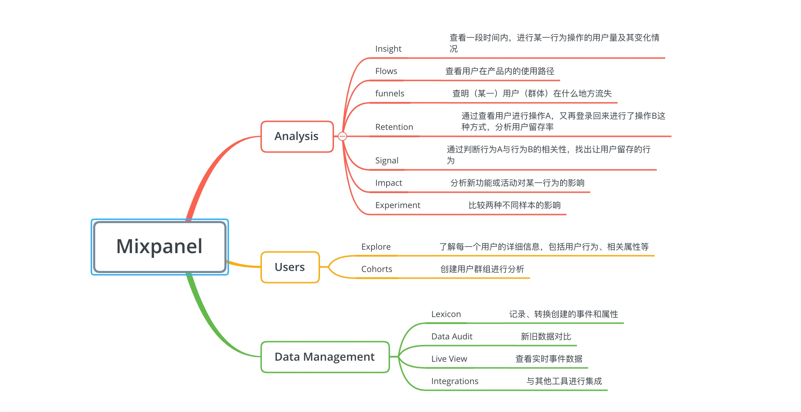

- [1. 埋点方案](#1-埋点方案)
  - [1.1  数据监控(用户埋点)](#11-数据监控用户埋点)
  - [1.2 性能监控  &  异常监控](#12-性能监控--异常监控)

# 1. 埋点方案

通常埋点的需求是为了监控系统一系列数据，包括数据监控、性能监控、异常监控。


## 1.1  数据监控(用户埋点)

这块主要是获取用户的一些行为数据，例如用户在页面停留的时间、跳出率、留存率、用户点击行为、页面跳转行为等。  
目前主要的埋点技术：_代码埋点、可视化埋点、无埋点_。

- **代码埋点**  
  代码埋点是最经典埋点方式，实施埋点的研发将埋点代码结合到业务代码中，实现用户行为数据的采集。这种埋点方式能采集到非常复杂的行为，尤其是一些非点击的、不可视的行为，必须用代码埋点来实现。代码埋点按照位置的不同，可以分为前端埋点、后端埋点。前端埋点用来记录用户在客户端的操作行为，后端埋点用来记录客户端进行服务器请求的日志。

  市场上的第三方数据采集均支持代码埋点, [诸葛  IO]()、[GA]()、 [GrowingIO]()、[神策]()、[百度统计]()、[TalkingData]()  等。

  > 优点：个性化自定义，能够根据企业自身业务特性自定义属性、事件，定制化获取数据.  
  > 缺点：时间、人力成本大。

  - 前端埋点  
     前端埋点能够收集更全面、精细的用户数据，尤其是不需要请求服务器的行为数据，如：页面停留时长、页面浏览深度、视频播放时长、用户鼠标轨迹、表单项停留及终止等等，只能通过前端埋点实现。不过前端埋点的上报一般存在 15% 左右的延迟上报和漏报（客户端未联网、数据打包上报、用户删除行为数据等原因）  
     在应用或界面初始化时，初始化埋点 SDK，在触发某个节点(如事件/页面)时调用  SDK  相应的方法，通过接口发送数据。
    前端代码埋点在具体实施中可以分为`命令式埋点`和`声明式埋点`。

    (1)命令式埋点

        ```js
        const handleClickBye = () => {
          //....业务代码 //采集埋点数据
          GrabAgent.click(...data);
        };
        //装载页面时
        useMount(() => {
          GrabAgent.onResume(...data);
        });
        //卸载页面时
        useUnmount(() => {
          GrabAgent.onPause(...data);
        });
        ```

    这种方式通常会对代码造成一定的侵入性。

    (2）声明式埋点  
     通过在 dom 节点上声明`data-{}`方式，通过脱耦的方式遍历所有声明过得 dom 节点并绑定上事件，需要上报的数据都放在`data-{}`里，例如如果是在 Vue 项目中可以通过自定义指令的方式。

        ```js
        <button v-focus="{type:"click",key:"shop"}" @click=”handleShop”>购买</button>
        ```

        ```js
              directives:{
                focus:{
                  bind:function(el,binding,vnode){
                    el.addEventListener('click',()=>{
                      GrabAgent.send(binding.value)
                    })
                  }
                }
              }
        ```

  - 后端埋点  
    相比于前端埋点，能实时采集数据，不存在延时上报，数据很准确；并且，服务端埋点支持与用户身份信息和行为附带属性信息整合；

- **可视化埋点**  
  使用可视化工具进行配置化的埋点，即所谓的「无痕埋点」，前端在页面加载时，可以读取配置数据，自动调用接口进行埋点。如开源的 Mixpanel;
   

  > 优点：埋点只需业务接入，无需开发进行代码上的埋点  
  > 缺点：仅支持客户端行为

- **无埋点**  
  原理：在应用中嵌入 SDK，做统一的“全埋点”，将应用中尽可能多的数据采集下来，通过界面配置的方式对关键行为进行定义，对定义的数据进行分析。  
  不区分功能优先，不能灵活地自定义属性，传输时效性和数据可靠性欠佳这几个缺点。甚至由于所有的控件事件都全部搜集，反而会给服务器和网络传输带来更大的负载。

---

_**当前流行的第三方数据产品**_

| 产品              | 体验                                                                                                       |
| ----------------- | ---------------------------------------------------------------------------------------------------------- |
| Umeng             | 阿里旗下的数据分析产品，通用性功能均有覆盖，在部分特定页面上有缺失，定制化弱，适合初创起步的企业应用       |
|  Google Analytics | 体验较好，对个人网页、应用所需的数据埋点都能满足，对数据结果展示较为友好                                   |
| 神策数据          | 可根据企业部署特定服务器，针对个性化定制，并且有对应业务员、开发工程师进行企业一对一对接，服务体验较为良好 |
| 诸葛 io           | 国内领先、先行的数据分析公司，2013 年是国内首家最早推出无埋点方案，但有运营朋友说丢包较为严重              |

---

## 1.2 性能监控  &  异常监控

**性能监控**  
 主要获取系统的性能参数指标。目前性能指标数据大部分来源于  window.performance API

**异常监控**  
 主要收集系统的出错的信息，方便开发快速定位进行  hotfix。如果采用自行开发埋点，则可以利用以下方法进行捕获异常，并将其上报。

``` js
try catch
window.onerror
window.addEventListener('error'，() => {})
window.addEventListener('unhandledrejection'() => {})
```

这种方式将可能对业务代码造成侵入性。
目前主流的前端监控系统主要有  [阿里  ARMS](https://www.aliyun.com/product/arms) 、[FUNdebug](https://www.fundebug.com/)、[Sentry](https://sentry.io/welcome/)  等，项目初期在异常监控这一块可以采用  Sentry  进行支持。

---

**采用 Sentry 进行性能监控和异常监控**

> [Sentry](https://sentry.io/welcome/)  是一个开源的实时错误追踪系统，可以帮助开发者实时监控并修复异常问题。它主要专注于持续集成、提高效率并且提升用户体验。
>  **Sentry**  分为服务端和客户端  SDK，可以直接使用其提供的在线服务，也可以本地自行搭建；提供了对多种主流语言和框架的支持，包括  React、Angular、Node、Django、RoR、PHP、Laravel、Android、. NET、JAVA  等。同时它可提供了和其他流行服务集成的方案，例如  GitHub、GitLab、bitbuck、heroku、slack、Trello  等。
> **在  React  项目中配置  Sentry** >

- 安装  Sentry

``` bash
yarn add @sentry/react
yarn add @sentry/react @sentry/tracing
```

- 在项目入口文件初始化

``` js
import React from "react";
import ReactDOM from "react-dom";
import * as Sentry from "@sentry/react";
import App from "./App";
Sentry.init({
    dsn: "https://<key>@sentry.io/<project>",
    release: "my-project-name@" + process.env.npm_package_version,
    integrations: [new Integrations.BrowserTracing()],
    // We recommend adjusting this value in production, or using tracesSampler
    // for finer control
    tracesSampleRate: 1.0,
});
ReactDOM.render( < App / > , document.getElementById("root"));
```

**其他常用高级使用方法**

1. 主动补货并上报错误  
   有时我们可能需要自己去主动去触发一些错误上报，比如一些特定操作、某些已经被弃用的接口被调用了、捕获一些线上运行数据去排查问题。可以利用 Sentry 提供过的 captureException 或者 captureMessage 去上报错误或者文本信息。

2. 丰富上报数据上下文  
   除了 user 用户信息，还可以有 tags、level、fingerprint、extra data。
   比如添加一些 tags，可以使用 scope.setTags(前端，不同语言语法不一样，如 Django 为 sentry_sdk.set_context) 可以给事件定义不同的键/值对。在后台查找的时候，筛选条件选项会多出来一些选项，就是通过 setTags 来设置的这些键值对。
